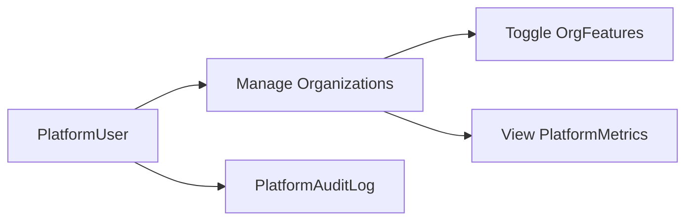
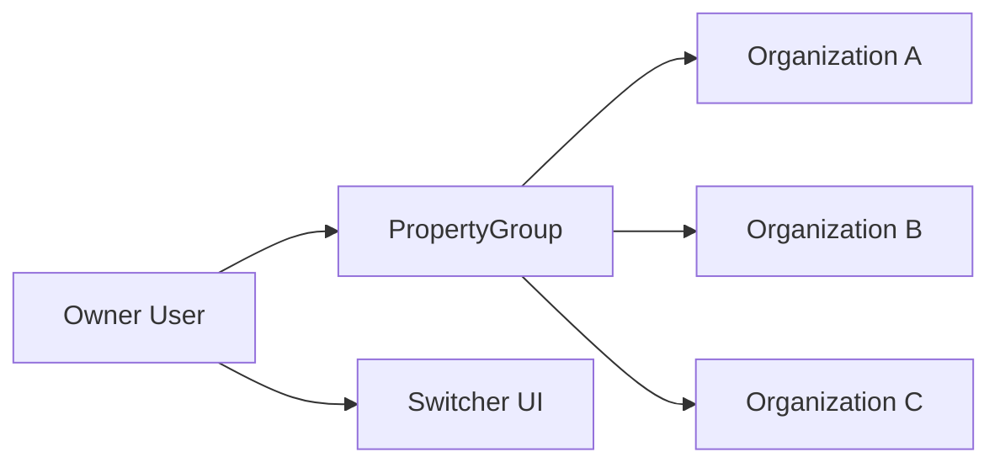
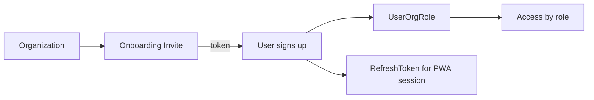
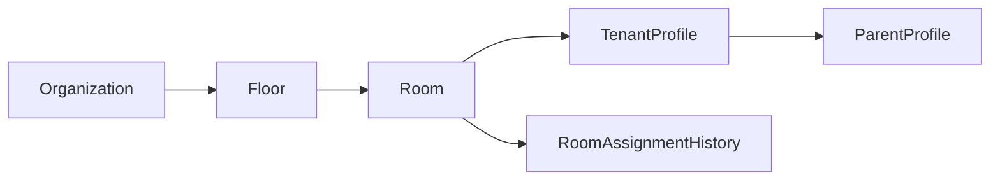
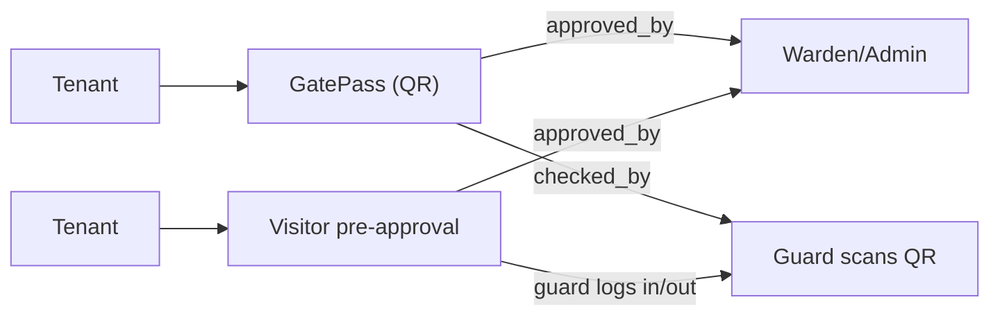
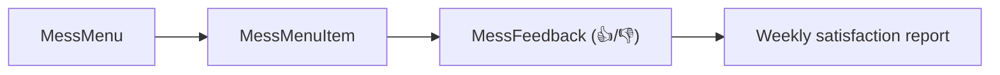
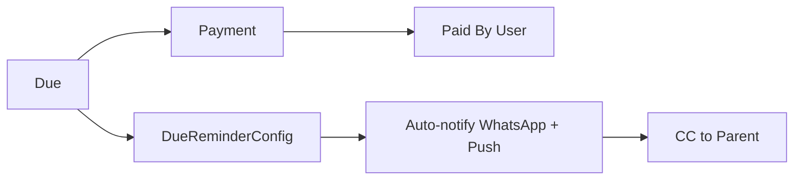
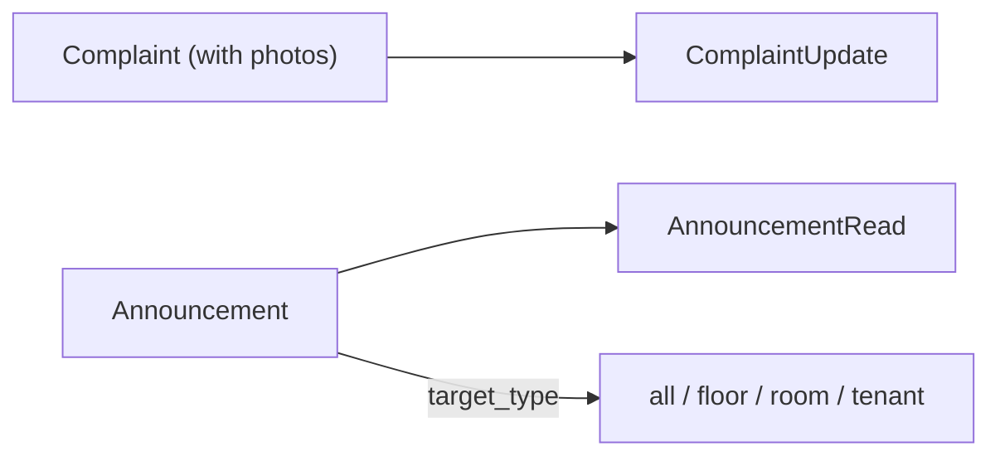
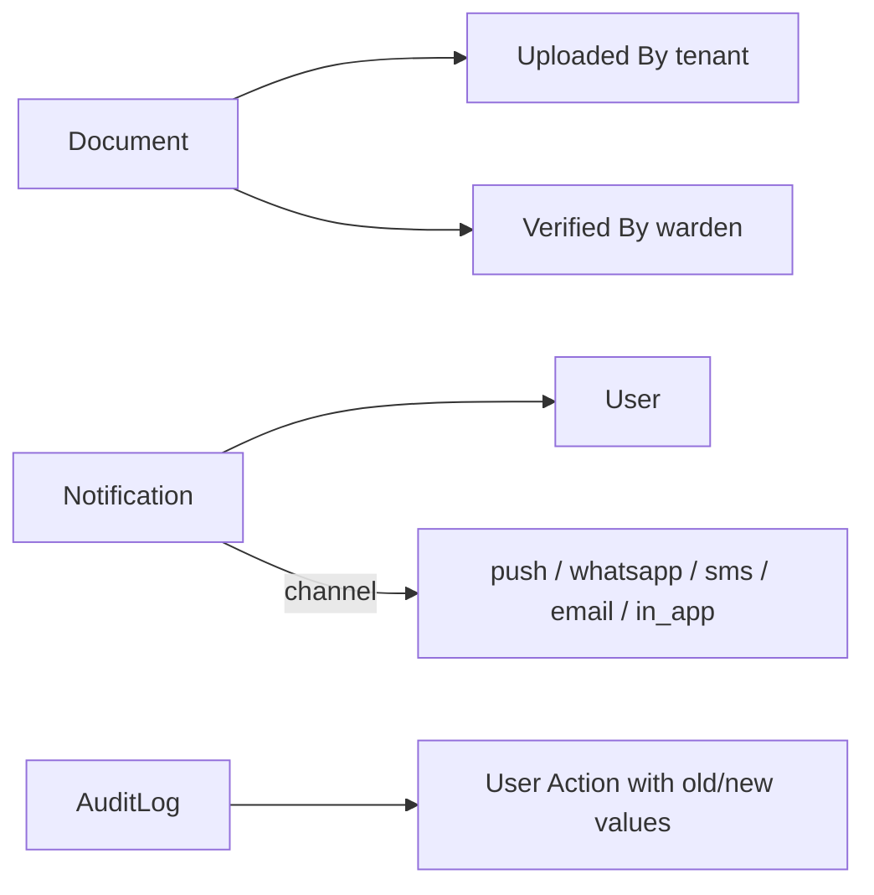

# Schema flow overview

This document summarizes the database schema and how data flows across the main modules.

## Modules at a glance
- **Platform (Super Admin)**: platform_users, platform_audit_logs, platform_metrics
- **Plans & subscriptions**: plans, organizations, org_features, property_groups
- **Users & auth**: users, user_org_roles, onboarding_invites, refresh_tokens
- **Property structure**: floors, rooms, tenant_profiles, parent_profiles, room_assignment_history
- **Gate pass & visitor log**: gate_passes, visitors
- **Mess menu & feedback**: mess_menus, mess_menu_items, mess_feedback
- **Dues & payments**: dues, payments, due_reminder_configs
- **Complaints & announcements**: complaints, complaint_updates, announcements, announcement_reads
- **Documents, staff, notifications & audit**: documents, staff_contacts, notifications, audit_logs

## Roles in the system

| Role | Enum value | Description |
|------|------------|-------------|
| PG/Hostel Owner | `owner` | Admin — full access + financials + warden management |
| Warden | `warden` | Day-to-day management, announcements, student CRUD |
| Guard | `guard` | Gate pass approval, QR scan, student in/out tracking |
| Staff | `staff` | Mess/housekeeping/maintenance — lightweight access |
| Tenant | `tenant` | Students/residents — gate pass, complaints, feedback |
| Parent | `parent` | Read-only view of ward's status, dues, gate passes |
| Super Admin | `PlatformUser` | 1forge team — separate table, manages all orgs |

## High-level ER diagram

```mermaid
erDiagram
  platform_users ||--o{ platform_audit_logs : performs
  organizations ||--o{ platform_metrics : tracked_by

  plans ||--o{ organizations : has
  property_groups ||--o{ organizations : groups
  users ||--o{ property_groups : owns
  organizations ||--o{ org_features : enables
  organizations ||--o{ user_org_roles : assigns
  organizations ||--o{ onboarding_invites : invites
  users ||--o{ user_org_roles : joins
  users ||--o{ onboarding_invites : sends
  users ||--o{ refresh_tokens : authenticates

  organizations ||--o{ floors : contains
  floors ||--o{ rooms : contains
  organizations ||--o{ rooms : owns
  organizations ||--o{ tenant_profiles : hosts
  rooms ||--o{ tenant_profiles : houses
  users ||--o{ tenant_profiles : is
  users ||--o{ parent_profiles : is
  users ||--o{ parent_profiles : linked
  organizations ||--o{ room_assignment_history : records
  rooms ||--o{ room_assignment_history : tracks
  users ||--o{ room_assignment_history : assigned

  organizations ||--o{ gate_passes : issues
  users ||--o{ gate_passes : requests
  users ||--o{ gate_passes : approves
  organizations ||--o{ visitors : logs
  users ||--o{ visitors : expects
  users ||--o{ visitors : approves

  organizations ||--o{ mess_menus : publishes
  mess_menus ||--o{ mess_menu_items : includes
  mess_menu_items ||--o{ mess_feedback : receives
  users ||--o{ mess_feedback : submits

  organizations ||--o{ dues : raises
  users ||--o{ dues : owes
  users ||--o{ dues : creates
  dues ||--o{ payments : settled_by
  users ||--o{ payments : pays
  organizations ||--|| due_reminder_configs : configures

  organizations ||--o{ complaints : receives
  users ||--o{ complaints : submits
  users ||--o{ complaints : assigned
  complaints ||--o{ complaint_updates : updates

  organizations ||--o{ announcements : publishes
  users ||--o{ announcements : creates
  announcements ||--o{ announcement_reads : read_by
  users ||--o{ announcement_reads : reads

  organizations ||--o{ documents : stores
  users ||--o{ documents : owns
  users ||--o{ documents : uploads
  users ||--o{ documents : verifies

  organizations ||--o{ staff_contacts : lists
  users ||--o{ staff_contacts : linked

  organizations ||--o{ notifications : sends
  users ||--o{ notifications : receives

  organizations ||--o{ audit_logs : records
  users ||--o{ audit_logs : performs
```

## Flow diagrams by feature

### 1) Super Admin — Platform management

### 2) Multi-property owner

### 3) Onboarding & roles

### 4) Property structure & occupancy

### 5) Gate passes & visitors

### 6) Mess menu & feedback

### 7) Dues & payments

### 8) Complaints & announcements

### 9) Documents, notifications & audit

## Key relationships (reference)
- **Organization** is the root entity for almost all modules.
- **PlatformUser** is completely isolated from org-level Users — Super Admins have their own table.
- **PropertyGroup** allows one owner to manage multiple organizations from a single login.
- **User** can act as tenant, parent, warden, guard, staff, or owner via `UserOrgRole`.
- **TenantProfile** links a user to a room and organization; supports soft-delete via `is_active` + `deactivated_at`.
- **RoomAssignmentHistory** preserves who was in which room, even after deactivation.
- **ParentProfile** links a parent user to a tenant, with per-tenant contact sharing toggles.
- **GatePass** has separate `approved_by` (warden) and `checked_by` (guard who scans QR) fields.
- **Visitor** supports tenant pre-approval flow with guard sign-in/out.
- **Dues** and **Payments** are tied to a tenant and org; payments settle dues; `amount_paid` tracks partial payments.
- **DueReminderConfig** configures automated reminders per org (days, channels, parent CC).
- **Payment** uses generic `gateway` + `gateway_order_id` / `gateway_payment_id` — not locked to any provider.
- **Complaints** track status changes via **ComplaintUpdate** and support photo attachments.
- **Announcements** can target all, a floor, a room, or a specific tenant; track read receipts.
- **StaffContact** has `is_emergency` flag for the tenant emergency page.
- **Notifications** support multiple channels and have separate `title` + `body` for push compatibility.
- **AuditLog** captures who did what and when across entities.
- **RefreshToken** manages PWA sessions with device and IP tracking.

## Unique constraints (data integrity)
| Table | Unique on | Purpose |
|-------|-----------|---------|
| `user_org_roles` | `(user_id, org_id, role)` | No duplicate role assignments |
| `org_features` | `(org_id, feature_key)` | One toggle per feature per org |
| `tenant_profiles` | `(user_id, org_id)` | One profile per tenant per org |
| `parent_profiles` | `(user_id, tenant_id, org_id)` | One parent-ward link per org |
| `floors` | `(org_id, floor_number)` | No duplicate floor numbers |
| `rooms` | `(org_id, room_number)` | No duplicate room numbers |
| `mess_menus` | `(org_id, week_start_date)` | One menu per week per org |
| `mess_menu_items` | `(menu_id, day_of_week, meal_type)` | One entry per meal slot |
| `mess_feedback` | `(tenant_id, menu_item_id)` | One rating per tenant per meal |
| `announcement_reads` | `(announcement_id, user_id)` | No duplicate read receipts |
| `platform_metrics` | `(org_id, metric_date)` | One snapshot per org per day |
